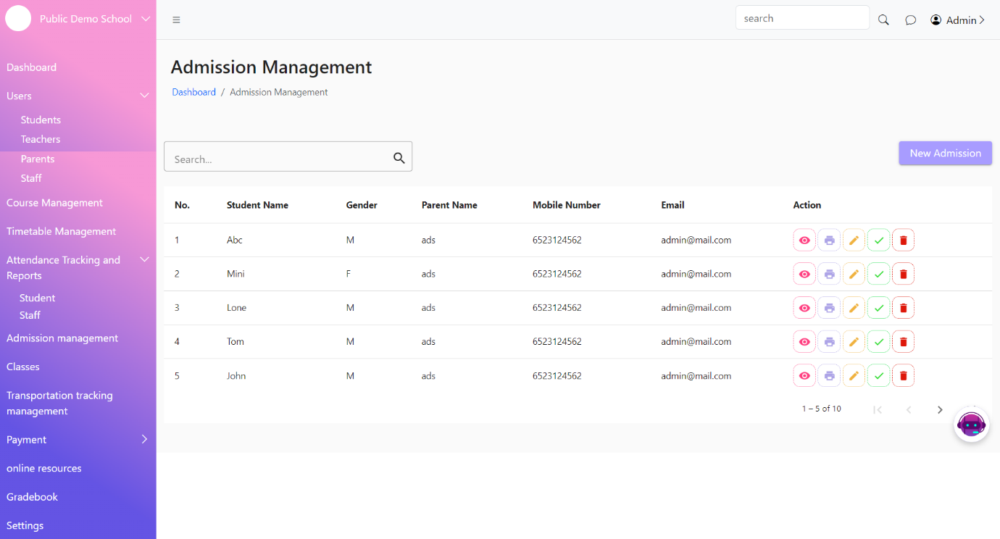
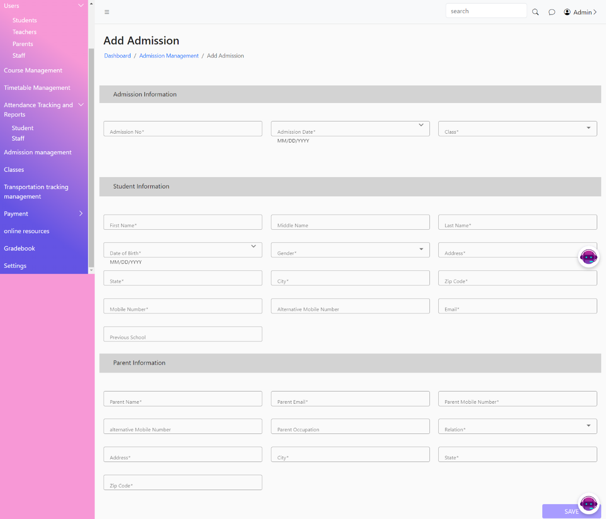
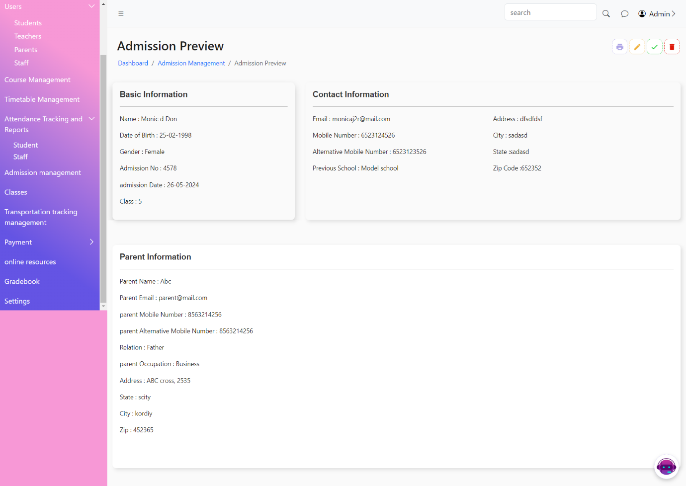

# Admission management

* &#x20;The Admission Management List Page displays a list of all admissions and applications in the student management system. This page allows users to view, search, print, edit, approve, and delete admission records.
* &#x20;The Add Admission Page allows users to add new admission records to the system. This page includes a form where users can enter student details and admission information.
* &#x20;The Admission Preview Page allows users to review detailed information about a specific admission application or record before finalizing it with options to approve, edit, and delete.
*

    <figure><figcaption></figcaption></figure>
*

    <figure><figcaption></figcaption></figure>
*

    <figure><figcaption></figcaption></figure>
