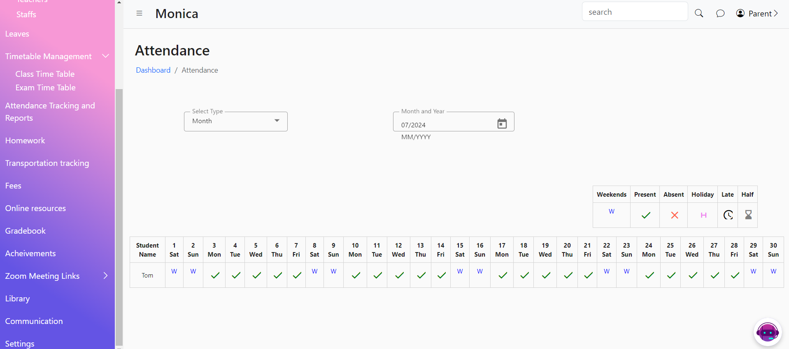

# Attendance Tracking and Reports

The Attendance Filter feature allows users to view and analyze attendance data for students on a weekly, monthly, or custom-period basis. This feature helps in tracking and managing student attendance effectively.

<figure><figcaption></figcaption></figure>
