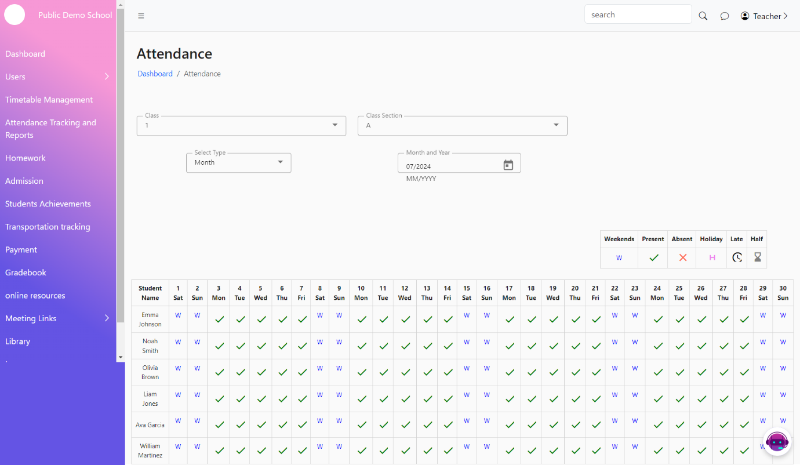

# Attendance Tracking and reports

The Attendance Page allows teachers to record and manage student attendance efficiently. Teachers can mark students as present or absent with simple interactions and view attendance history with various filters.

**Features**

1. **Mark Attendance**: Teachers can mark a student as present with a single click and absent with a double click.
2. **Previous Day Attendance**: Teachers can mark attendance for any previous day within the current month.
3. **Attendance History**: Teachers can view and filter attendance records by the current week, month, or specific period.
4.

    <figure><figcaption></figcaption></figure>
5.

    <figure><figcaption></figcaption></figure>
