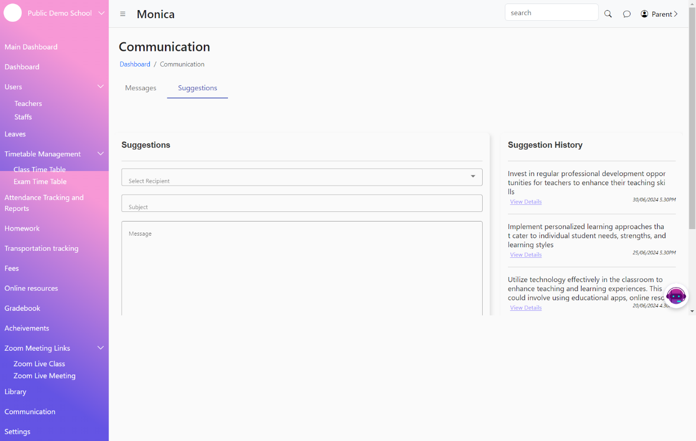
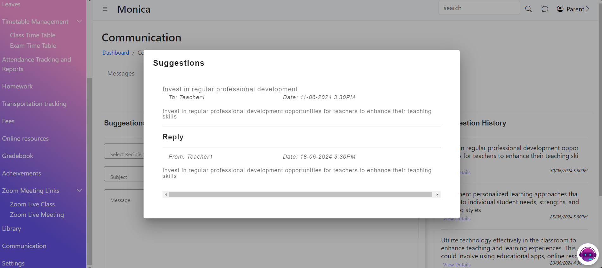

# Communication

The communication features in the student management system allow parents and students to send messages to teachers and provide suggestions to the school administration. These features facilitate effective communication and feedback within the school community.

<figure><figcaption></figcaption></figure>

<figure><figcaption></figcaption></figure>

<figure><figcaption></figcaption></figure>

<figure><figcaption></figcaption></figure>
