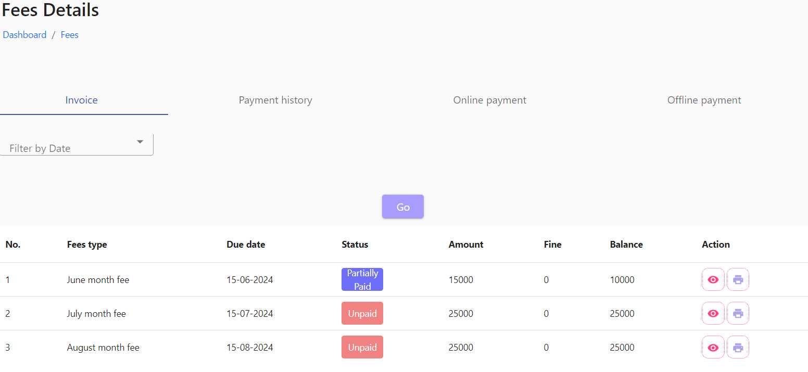
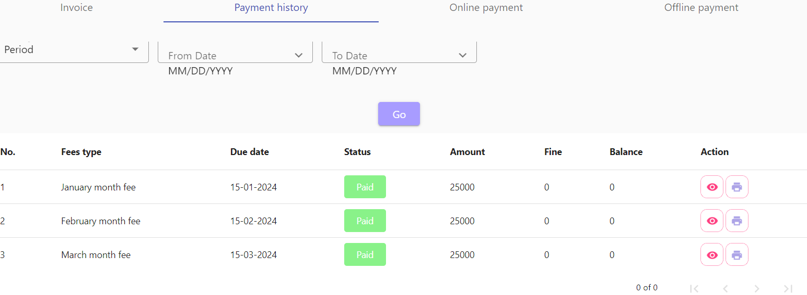
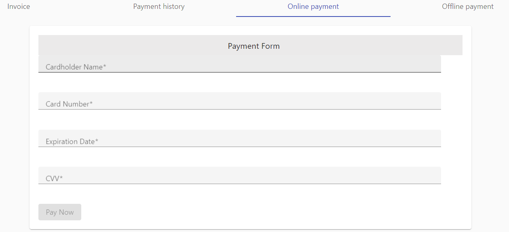
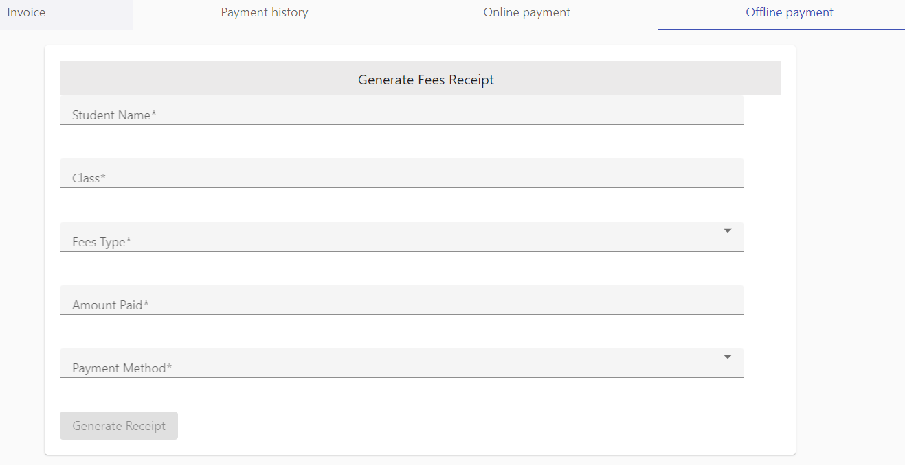

# Fees

The first tab Invoice is to know the pending fees details and by clicking the ‘partially or unpaid’ button, parents can pay fees online, in second tab, is the previous fees payment history list, and the third tab is for payment of fees online and the last tab is to generate fees receipt which is paid by the offline mode.

<figure><figcaption></figcaption></figure>

<figure><figcaption></figcaption></figure>

<figure><figcaption></figcaption></figure>

<figure><figcaption></figcaption></figure>
