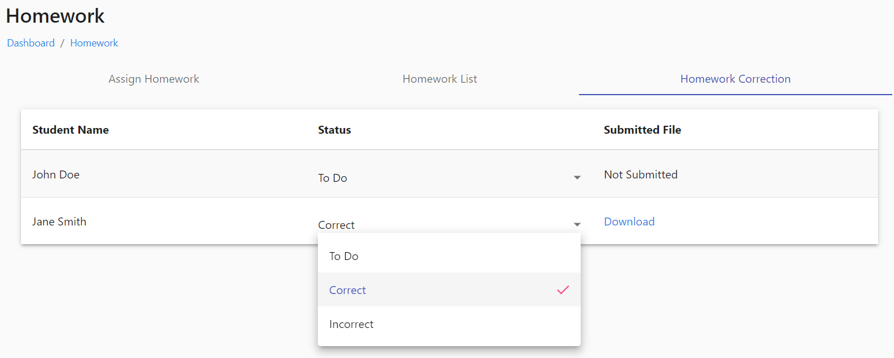

# Homework

The first tab is for assigning homework for each class by the teacher according to their subjects handled in each classes, second tab is for listing the homework added and can edit ,add and delete the homework and third tab is for correcting the homework for each students.

<figure><figcaption></figcaption></figure>

<figure><figcaption></figcaption></figure>

<figure><figcaption></figcaption></figure>
