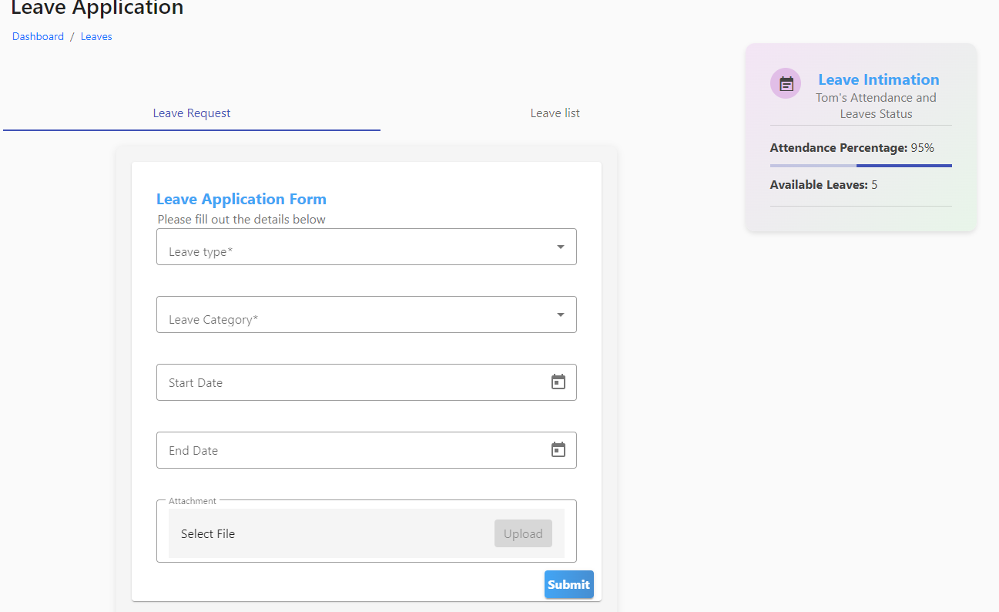

# Leave

Parents can apply for leave for their child by giving leave requests to the teacher and they can also have the list of leave history in which they can know about the status of the leave, view, edit, and delete.

<figure><figcaption></figcaption></figure>

<figure><figcaption></figcaption></figure>
