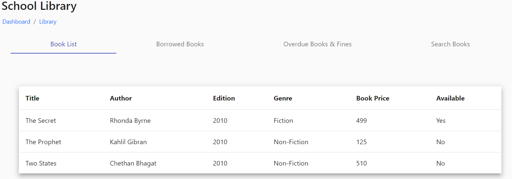
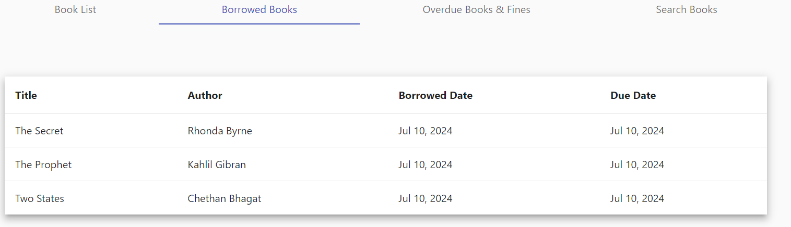
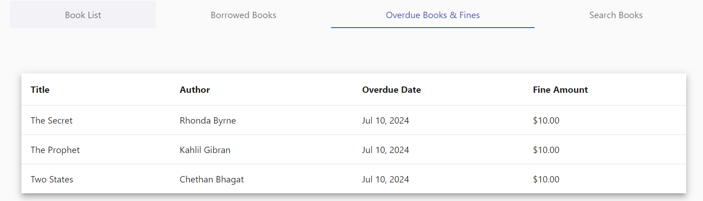
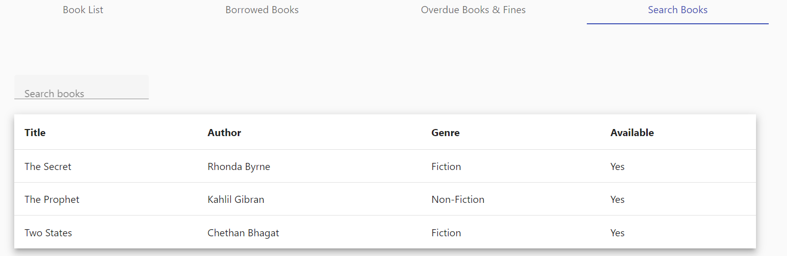

# Library

Teacher can use school library in which the first tab is for the list of total books in the school library, second tab is for list of books taken by the teacher, third tab is to know the details of overdue books and the fine amount and the last tab is for searching the books.

<figure><figcaption></figcaption></figure>

<figure><figcaption></figcaption></figure>

<figure><figcaption></figcaption></figure>

<figure><figcaption></figcaption></figure>
