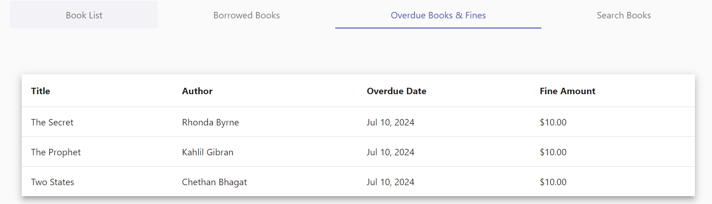
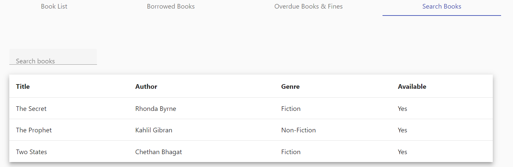

# Library

The parent can view the school library in which the first tab is for the list of total books in the school library, the second tab is for the list of books taken by their child, the third tab is to know the details of overdue books and the fine amount and the last tab is for searching the books.

<figure><figcaption></figcaption></figure>

<figure><figcaption></figcaption></figure>

<figure><figcaption></figcaption></figure>

<figure><figcaption></figcaption></figure>
