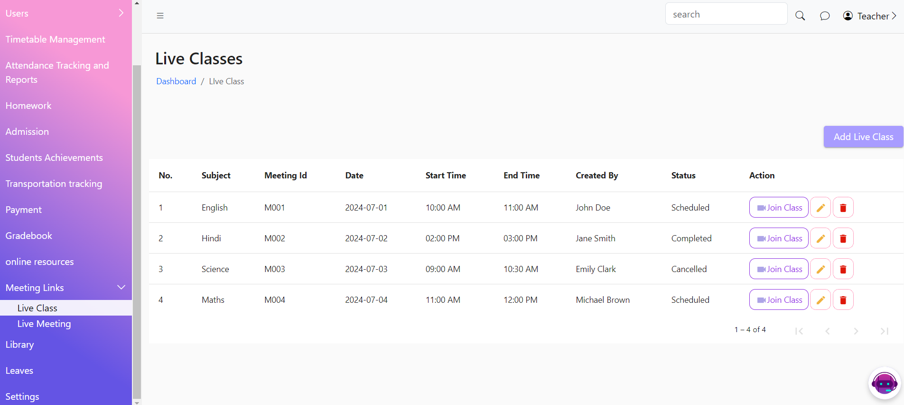
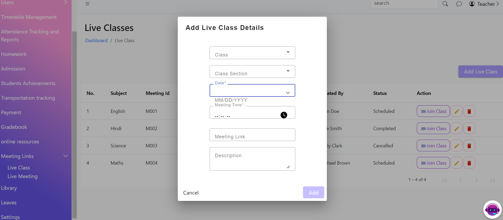
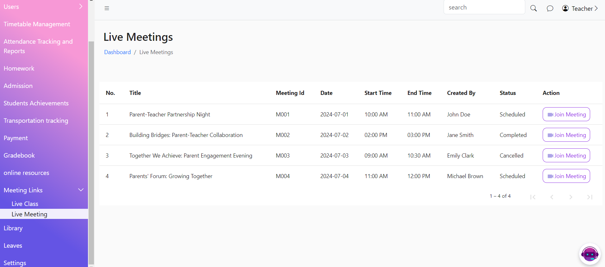

# Meeting Link

The Meeting Links page allows teachers to add and manage online class links and view meetings hosted for teachers. This feature streamlines the scheduling and attending of online classes and teacher meetings.

<figure><figcaption></figcaption></figure>

<figure><figcaption></figcaption></figure>

<figure><figcaption></figcaption></figure>
