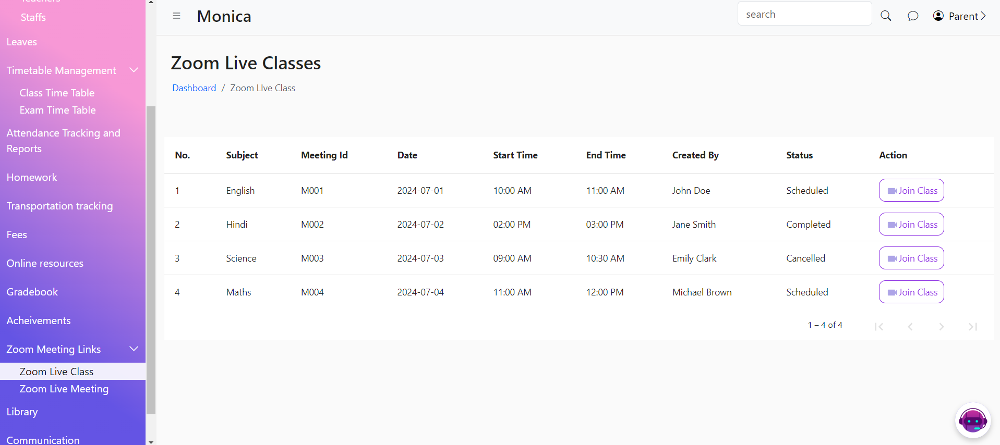
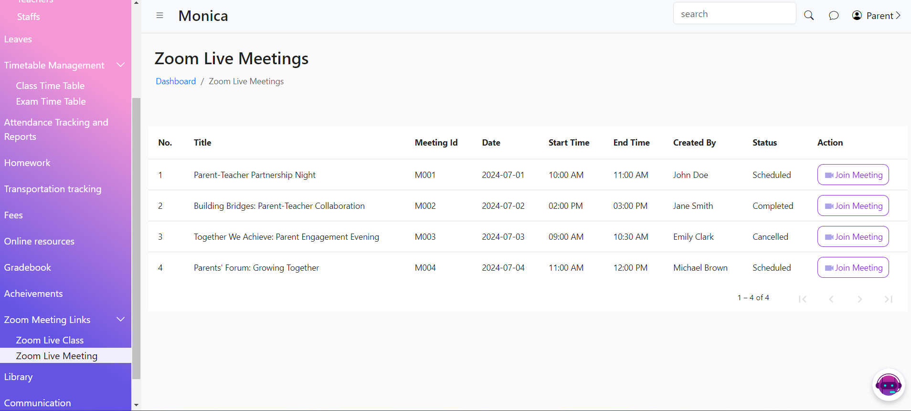

# Meeting Links

The Live Class and Live Meeting feature enable teachers to conduct real-time online classes for students and hold virtual meetings with parents. These features integrate with popular video conferencing platforms to provide seamless access to live sessions.

<figure><figcaption></figcaption></figure>

<figure><figcaption></figcaption></figure>
