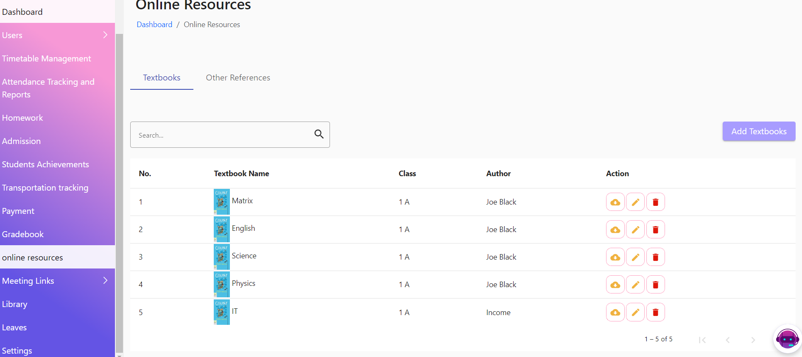
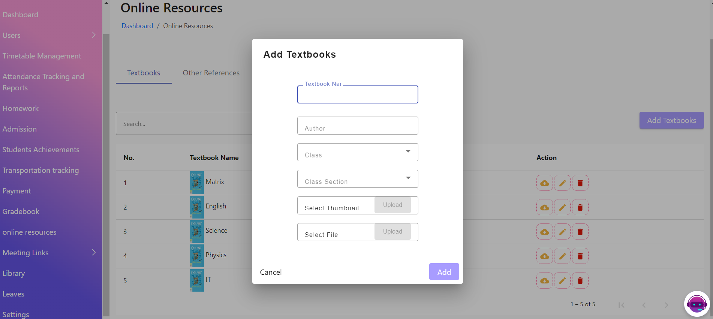
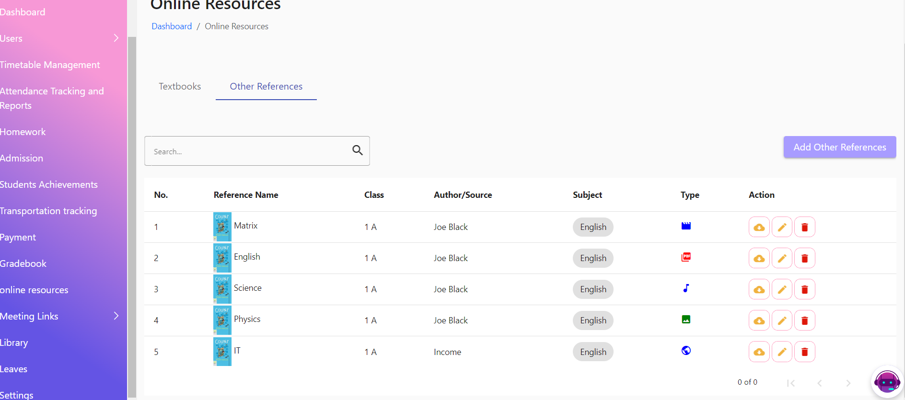
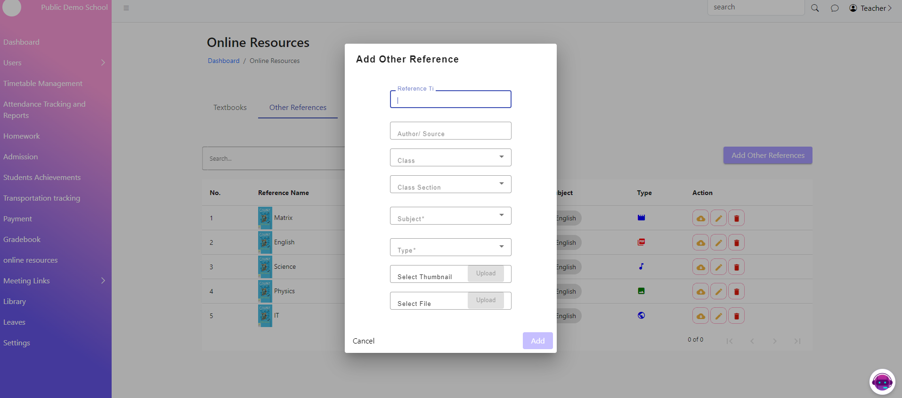

# Online Resources

The Online Resources page allows teachers to add and manage online textbooks, references, and other educational materials. This feature enhances the learning experience by providing easy access to necessary resources.

**Features**

1. **Add Online Textbooks**: Teachers can upload and link online textbooks.
2. **Add References**: Teachers can add links to reference materials.
3. **Resource Management**: Teachers can organize, update, and delete resources.
4. **Search and Filter**: Teachers can search and filter resources by subject, grade, and type.

<figure><figcaption></figcaption></figure>

<figure><figcaption></figcaption></figure>

<figure><figcaption></figcaption></figure>

<figure><figcaption></figcaption></figure>

<figure><figcaption></figcaption></figure>
