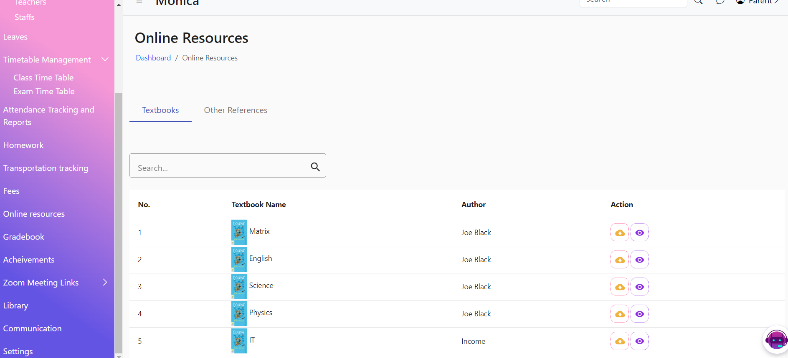
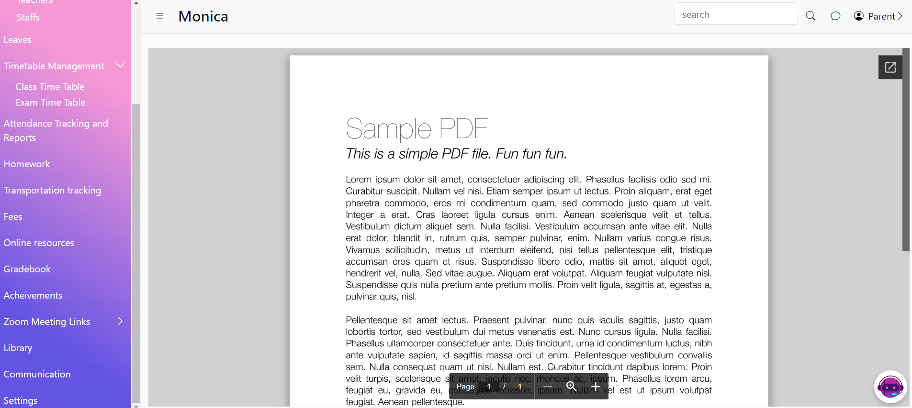
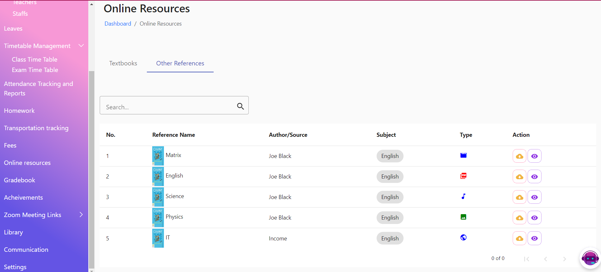

# Online Resources

The Online Resources Page provides parents access to a variety of educational materials including textbooks, reference materials, videos, audios, and documents. This feature is designed to support student learning by providing additional resources outside of the classroom.

<figure><figcaption></figcaption></figure>

<figure><figcaption></figcaption></figure>

<figure><figcaption></figcaption></figure>
