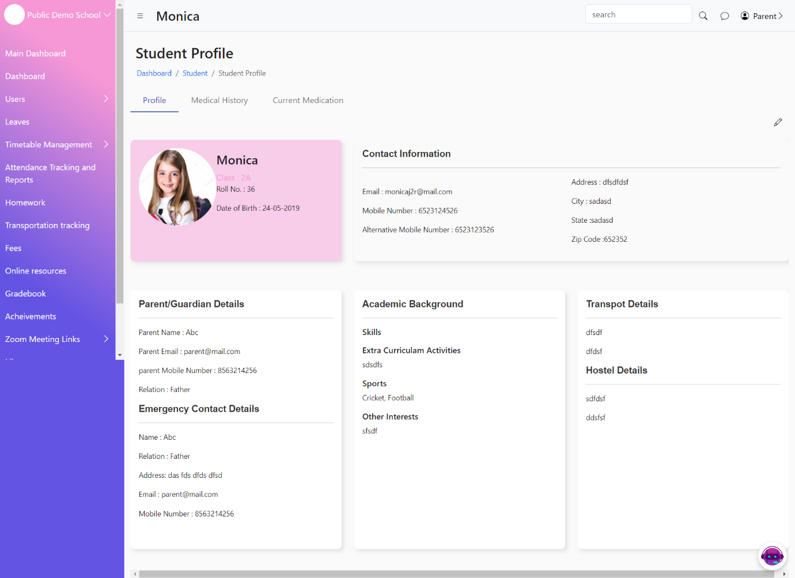
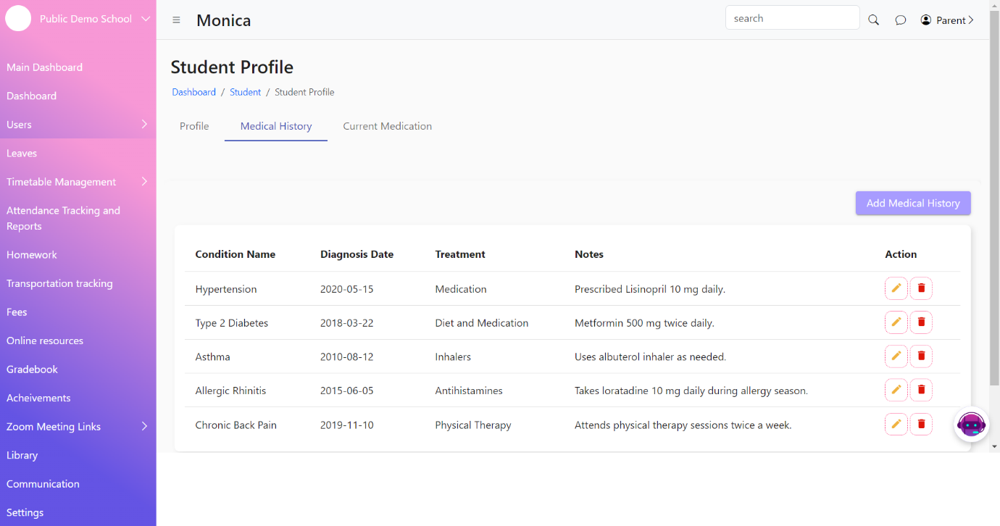
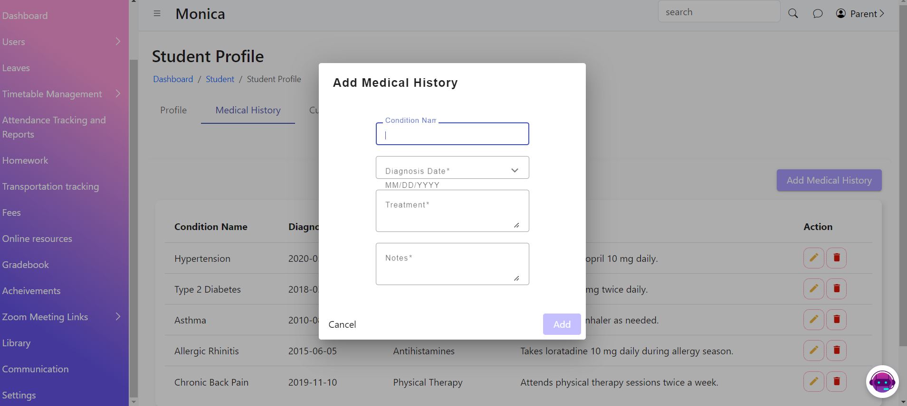
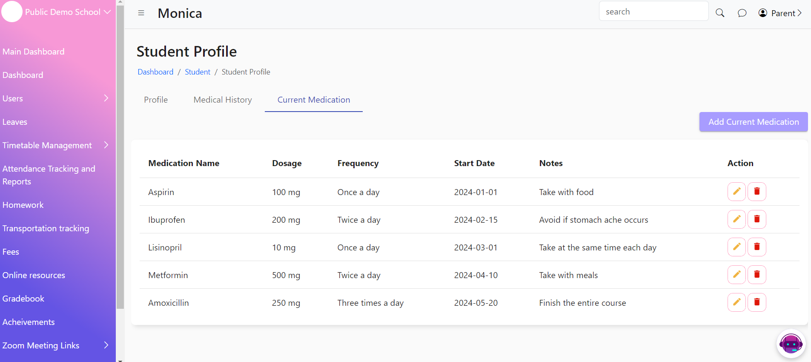

# Child Profile

&#x20;The Student Profile Page provides a comprehensive view of each student's personal information, medical history, and current medications. It also includes functionalities for adding and updating medical history and current medication records.

·  Student Information

* Displays basic personal details of the student.
* Includes name, date of birth, grade, contact information, and emergency contact details.

·  Medical History

* Lists the student's past medical history, including previous illnesses, surgeries, and allergies.
* Allows parents and authorized personnel to view detailed medical records.

·  Current Medications

* Displays a list of medications the student is currently taking.
* Includes medication names, dosages, and schedules.

·  Add Medical History

* Provides a form to add new medical history entries for the student.
* Fields for illness/surgery name, date, description, and notes.

·  Add Current Medications

* Provides a form to add new current medication entries for the student.
* Fields for medication name, dosage, and schedule
*

    <figure><figcaption></figcaption></figure>
*

    <figure><figcaption></figcaption></figure>
*

    <figure><figcaption></figcaption></figure>
*

    <figure><figcaption></figcaption></figure>
