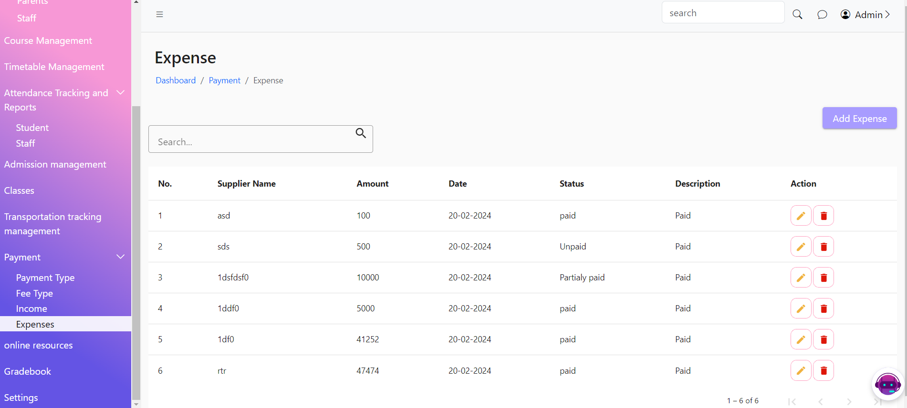
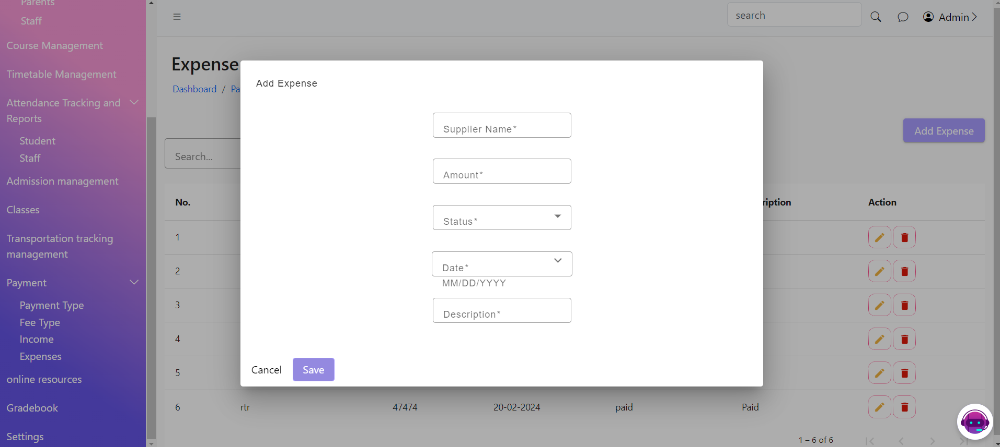

# Expenses

The Expenses List Page displays a list of all expense records in the system. This page allows users to view, search, edit, and delete Expenses entries.

The Add Expenses Page allows users to add new Expenses records to the system. This page includes a form where users can enter Expense details.

<figure><figcaption></figcaption></figure>

<figure><figcaption></figcaption></figure>
