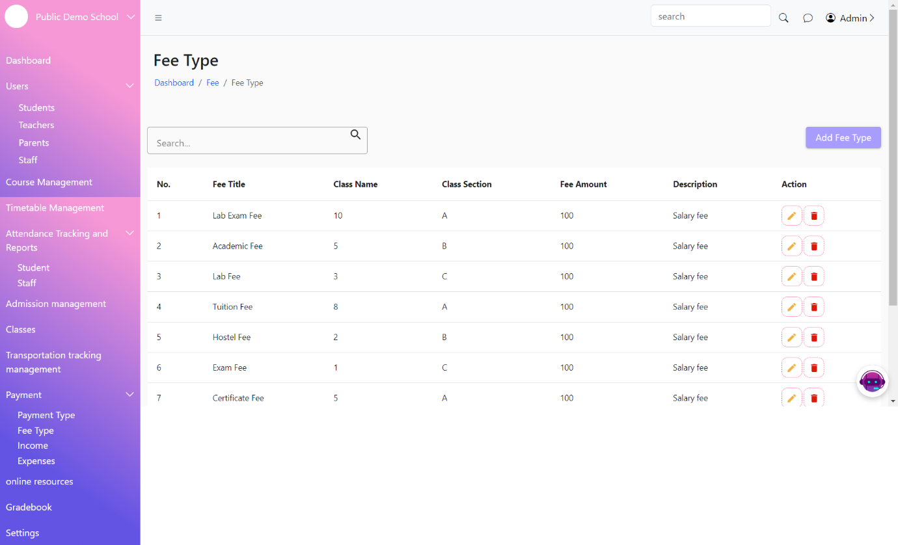
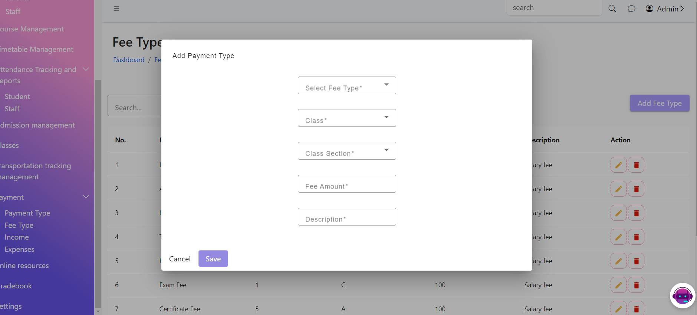

# Fee Type

The Fee Type List Page displays a list of all fee types available in the system. This page allows users to view, edit, delete, and manage fee types.

The Add Fee Type Page allows users to add new fee types to the system. This page includes a form where users can enter fee-type details.

<figure><figcaption></figcaption></figure>

<figure><figcaption></figcaption></figure>
