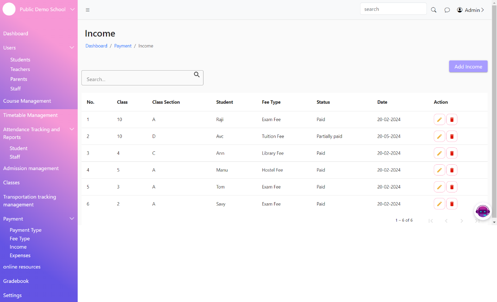
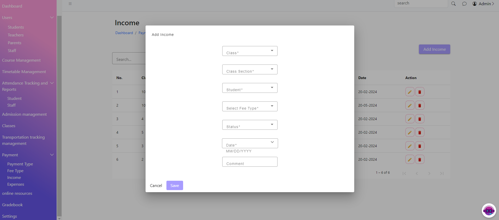

# Income

The Income List Page displays a list of all income records in the system. This page allows users to view, search, edit, and delete income entries.

&#x20;The Add Income Page allows users to add new income records to the system. This page includes a form where users can enter income details.

<figure><figcaption></figcaption></figure>

<figure><figcaption></figcaption></figure>
