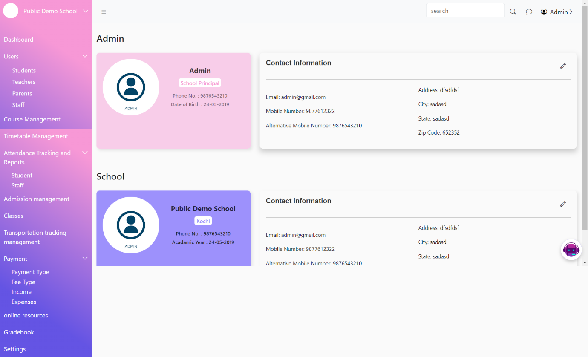

# Settings

The Settings Page allows administrators to manage and update administrative and school-related information. This includes editing admin details and school information.

<figure><figcaption></figcaption></figure>

<figure><figcaption></figcaption></figure>
