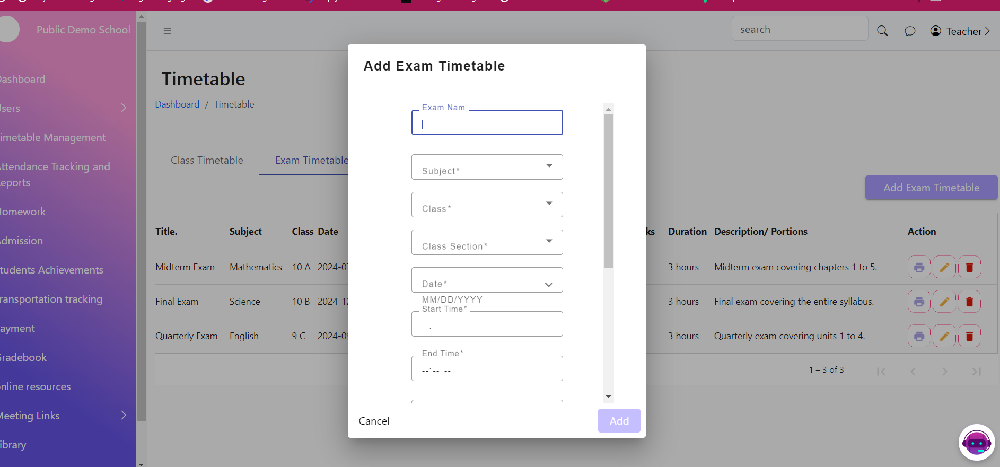

# Timetable Management

Teachers can efficiently manage their schedules and plan their classes with the ability to view the class timetable and both view and add the exam timetable. These features provide a streamlined approach to organizing class and exam schedules.

<figure><figcaption></figcaption></figure>

<figure><figcaption></figcaption></figure>

<figure><figcaption></figcaption></figure>
