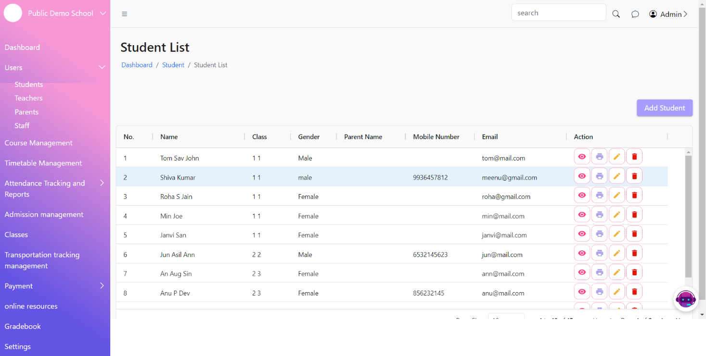
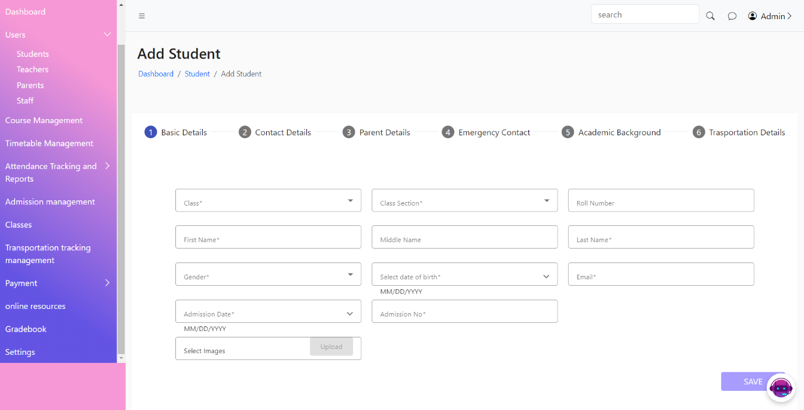

# Students

* [x] The Student List Page displays a list of all students enrolled in the school. This page allows users to view, search, sort, filter, edit, delete, view, and print student records.
* [x] The Add Student Page allows users to add a new student to the system. This page includes a form where users can enter student details.
*   [x] The Student Profile Page displays detailed information about a specific student.

    &#x20;  &#x20;
*
[ ] 
    <figure><figcaption></figcaption></figure>
*
[ ] 
    <figure><figcaption></figcaption></figure>
*
[ ] 
    <figure><figcaption></figcaption></figure>
